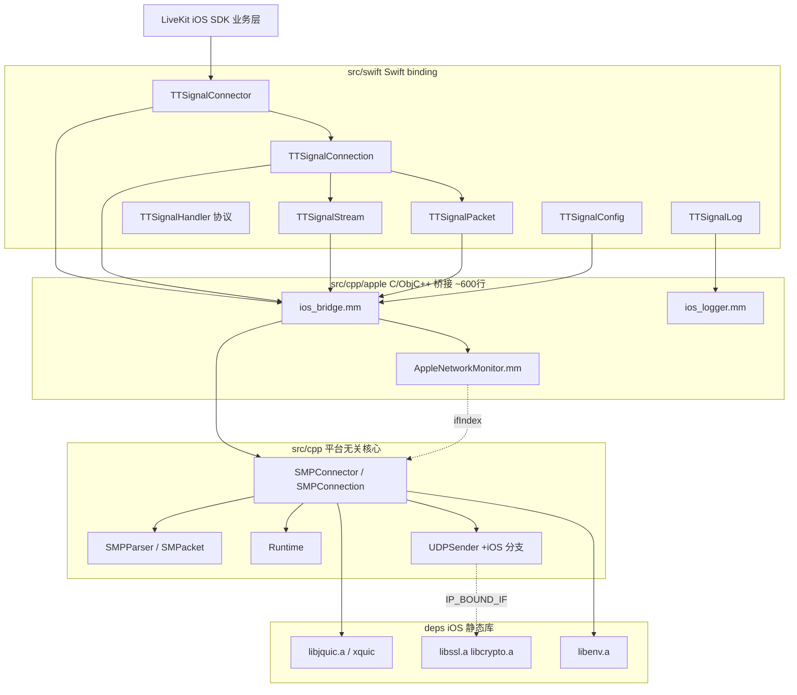
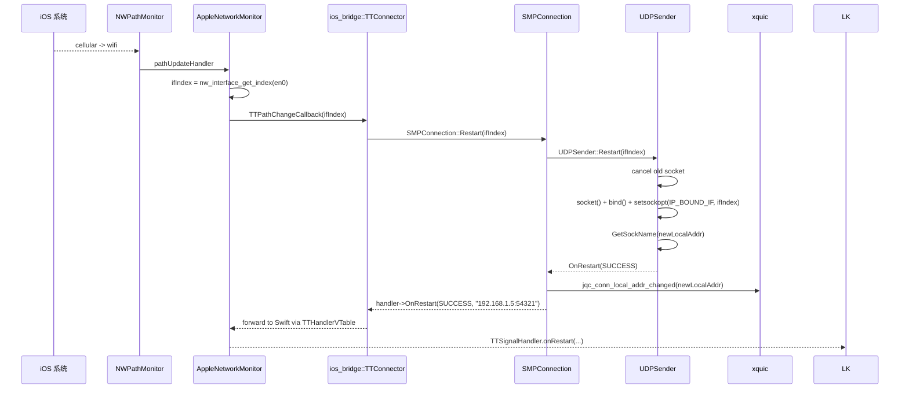

# iOS QUIC Migration 方案 C 设计文档（xquic 移植 + Swift binding）

## 1. 目标 & 与方案 A 的对比

| 维度 | 方案 A（NWProtocolQUIC） | 方案 C（xquic + BSD socket，本方案） |
|---|---|---|
| QUIC 实现 | Apple Network.framework 系统进程内的 QUIC | 复用 [`deps/jquic`](../deps/jquic) 用户态 xquic |
| Connection ID 兼容 | ❌ 19 字节 LiveKit server CID 触发 Apple QUIC 解析失败 | ✅ xquic 完整支持 RFC 9000 任意 CID 长度 |
| 网卡切换 | 系统决定，对 19B CID 无效 | 自研 `AppleNetworkMonitor` 监听 NWPathMonitor，触发 `SMPConnection::Restart`，xquic `jqc_conn_local_addr_changed` 完成 RFC 9000 migration |
| 上层介入 | 业务层 cancel + 重建 | **零介入**，bridge 内部处理 |
| 跨端 API | iOS 独有 | 与 Android Java `Connector/Connection/Stream` 一一对齐 |
| 拥塞控制 | 系统默认 | BBR / BBR2 / CUBIC / Reno / COPA / Unlimited 可选 |
| 协议帧 | HTTP/3 / QUIC 原生 | SMP 自研帧（Command / Message / UserControl）+ LiveKit protobuf 透传 |
| 日志可见 | 系统 nehelper 日志（受限） | OSLog + 可注入 Swift sink，UI 实时显示 |
| 产物 | 无（用 Apple framework） | `TTSignal.xcframework`（device arm64 + sim fat） |
| 真机验证 | path 变化但 socket 不重建 → SMP 帧无法继续 | （待真机验证：cellular ↔ wifi 自动 restart） |

方案 A 实测细节见 [`PLAN_A_EXPERIMENT_REPORT.md`](./PLAN_A_EXPERIMENT_REPORT.md)。

## 2. 架构



切网自动 restart 时序（应用层零介入）：



## 3. API 对照表（Java Android ↔ Swift iOS ↔ extern C）

| Java（Android） | Swift（iOS） | extern "C"（iOS bridge） |
|---|---|---|
| `Connector(Config)` | `TTSignalConnector(config:)` | `tt_connector_create(TTConfig*)` |
| `Connector.createConnection(Config, IConnectionHandler)` | `TTSignalConnector.createConnection(config:, handler:)` | `tt_connector_create_connection(TTConnectorRef, TTConfig*, TTHandlerVTable*, void*)` |
| `Connector.getStats()` | `TTSignalConnector.getStats() -> String?` | `tt_connector_get_stats(TTConnectorRef, char*, size_t)` |
| `Connector.close()` | `TTSignalConnector.close()` | `tt_connector_close(TTConnectorRef)` |
| `Connection.connect(url, props, timeout)` | `TTSignalConnection.connect(url:, propsJson:, timeoutMs:)` | `tt_connection_connect(TTConnectionRef, const char*, const char*, int32_t)` |
| `Connection.sendPacket(Packet)` | `TTSignalConnection.sendPacket(_:)` / `Stream.sendCmd / sendData` | `tt_connection_send_packet(TTConnectionRef, TTPacketRef)` |
| `Connection.restart(networkHandle)` | `TTSignalConnection.restart(interface:)` | `tt_connection_restart(TTConnectionRef, int64_t)` |
| `Connection.close()` | `TTSignalConnection.close()` | `tt_connection_close(TTConnectionRef)` |
| `Connection.closeStream(streamId)` | `TTSignalConnection.closeStream(streamId:)` | `tt_connection_close_stream(TTConnectionRef, int32_t)` |
| `Stream(connection, streamId)` | `TTSignalStream(connection:, id:)` | （由 `tt_packet_create` + `tt_connection_send_packet` 隐式构造） |
| `new Packet(type, ts, transId, streamId, data)` | `TTSignalPacket(type:, timestamp:, transId:, streamId:, payload:)` | `tt_packet_create(uint8_t, int64_t, int32_t, int32_t, const uint8_t*, size_t)` |
| `IConnectionHandler.onConnectResult(int, String)` | `TTSignalHandler.onConnectResult(_:, error:, message:)` | `TTHandlerVTable.on_connect_result(void*, int32_t, const char*)` |
| `IConnectionHandler.onStreamCreated(int)` | `TTSignalHandler.onStreamCreated(_:, stream:)` | `TTHandlerVTable.on_stream_created(void*, int32_t)` |
| `IConnectionHandler.onStreamClosed(int)` | `TTSignalHandler.onStreamClosed(_:, stream:)` | `TTHandlerVTable.on_stream_closed(void*, int32_t)` |
| `IConnectionHandler.onStreamDataAcked(...)` | `TTSignalHandler.onStreamDataAcked(...)` | `on_stream_data_acked(...)` |
| `IConnectionHandler.onStreamDataSent(...)` | `TTSignalHandler.onStreamDataSent(...)` | `on_stream_data_sent(...)` |
| `IConnectionHandler.onRecvCmd(...)` | `TTSignalHandler.onRecvCmd(...)` | `on_recv_cmd(...)` |
| `IConnectionHandler.onRecvData(...)` | `TTSignalHandler.onRecvData(...)` | `on_recv_data(...)` |
| `IConnectionHandler.onRestart(int, String)` | `TTSignalHandler.onRestart(_:, result:, address:)` | `on_restart(void*, int32_t, const char*)` |
| `IConnectionHandler.onClosed(String)` | `TTSignalHandler.onClosed(_:, reason:)` | `on_closed(void*, const char*)` |
| `IConnectionHandler.onException(...)` | `TTSignalHandler.onException(_:, errMsg:)` | `on_exception(void*, const char*)` |
| `Config.LogHandler` | `TTSignalLog.setSink((LogLevel, String) -> Void)` | `tt_logger_set_callback(TTLogCallback, void*)` |

**Swift `restart(interface:)` 与 Android `restart(networkHandle)` 的语义映射**：iOS 上 `interface.name`（BSD 名，如 `en0`/`pdp_ip0`）经 `if_nametoindex` 转成内核 ifIndex，传到 `setsockopt(IP_BOUND_IF, ifIndex)`，等价于 Android 上的 `android_setsocknetwork(networkHandle, fd)`。**业务通常不需要手动调** —— `AppleNetworkMonitor` 已经把 `NWPathMonitor` 的 path 变化自动转成 restart。

## 4. 文件树

```
src/cpp/UDPSender.cpp                # 加 #elif TARGET_OS_IOS 分支：setsockopt(IP_BOUND_IF/IPV6_BOUND_IF)
src/cpp/SMPParser.cpp                # malloc.h 在 Apple 平台改用 <malloc/malloc.h>

src/cpp/apple/                       # Apple 平台桥接（macOS NAPI + iOS xcframework 共用 monitor；iOS Swift bridge 文件仅 iOS 用）
├── CMakeLists.txt                   # 暴露源文件 / 头文件 / module.modulemap 给 src/CMakeLists.txt
├── ios_bridge.h                     # extern "C" Swift 入口；TTConnector / TTConnection / TTPacket 不透明句柄；TTConfig POD；TTHandlerVTable（仅 iOS）
├── ios_bridge.mm                    # IOSHandlerProxy / IOSConnectorHandlerProxy；URL 解析（仅 iOS）
├── AppleNetworkMonitor.h            # 跨 iOS+macOS 共用
├── AppleNetworkMonitor.mm           # NWPathMonitor 包装，path 变化时取 if_nametoindex 调 callback
├── ios_logger.h                     # 仅 iOS Swift binding
├── ios_logger.mm                    # OSLog 后端 + tt_logger_set_callback Swift 接管
└── module.modulemap                 # `module TTSignalC { ... }` 给 Swift import（仅 iOS）

src/swift/                           # Swift binding
├── TTSignalConnector.swift          # 对应 Connector.java
├── TTSignalConnection.swift         # 对应 Connection.java + restart(interface:)
├── TTSignalStream.swift             # 对应 Stream.java
├── TTSignalPacket.swift             # 对应 Packet.java
├── TTSignalConfig.swift             # 对应 Config.java；含 withCConfig(_:)
├── TTSignalHandler.swift            # 对应 IConnectionHandler.java
└── TTSignalLog.swift                # 对应 Config.LogHandler

deps/env/src/BC/linux/BCSocket.h     # GetFd() 的 #ifdef 加 OS_APPLE 让 iOS 也能拿到 fd

src/cpp/cmake/ios.toolchain.cmake    # 包装 deps/jquic/cmake/ios.toolchain.cmake；统一三个 slice 的 SYSROOT/ARCH/MIN
src/CMakeLists.txt                   # 加 BUILD_IOS_FRAMEWORK 选项 + ttsignal_ios STATIC target

ios/scripts/build-deps.sh            # boringssl + jquic + env -> build/ios-deps/<sdk>-<arch>/lib/*.a
ios/scripts/build-core.sh            # ttsignal_ios -> build/ios-<slice>/dist/{lib, Headers, Modules}/
ios/scripts/build-xcframework.sh     # libtool merge + lipo fat + xcodebuild -create-xcframework

build/ios-device-arm64-release/build # 单架构便捷脚本（device arm64）
build/ios-sim-arm64-release/build    # 单架构便捷脚本（sim arm64）
build/ios-sim-x64-release/build      # 单架构便捷脚本（sim x86_64）
build/ios-deps/                      # build-deps.sh 输出
build/ios-xcframework/TTSignal.xcframework  # 最终产物

ios/QUICTest/                        # 改造为依赖新 binding
├── QUICTestApp.swift
├── ContentView.swift                # 重写：State / Restarts / Migration 卡片
├── QUICClientDemo.swift             # 重写：用 TTSignal* API
├── Logging.swift                    # 替代旧 LiveKitStubs.swift 的本地 stub
├── QUICTest.entitlements
├── Assets.xcassets/
└── TTSignal*.swift                  # symlink 到 src/swift/*.swift（避免拷贝）

ios/QUICClient.swift                 # 已删除（被新 binding 取代）
ios/PLAN_A_EXPERIMENT_REPORT.md      # 已加废弃标记，指向本文档
ios/PLAN_C_DESIGN.md                 # 本文档
```

## 5. 依赖编译流程

iOS 上 `boringssl`、`jquic`、`env` 都是 C/C++ 静态库，必须用 iOS toolchain 单独编译三份（device arm64、sim arm64、sim x86_64）。流程：

```bash
# 1) 一次性编译三架构依赖（耗时约 10 分钟，输出到 build/ios-deps/）
ios/scripts/build-deps.sh

# 2) 编译 ttsignal core + iOS bridge 三架构（耗时约 1 分钟）
ios/scripts/build-core.sh

# 3) 合并为 xcframework
ios/scripts/build-xcframework.sh
```

或单架构调试（最常用）：

```bash
cd build/ios-sim-arm64-release && ./build
```

### 5.1 boringssl 离线编译技巧

`boringssl/crypto/CMakeLists.txt` 在 `err_data.c` 不存在时会通过 Go 拉 `golang.org/x/crypto`。`build-deps.sh` 内置 `find_pregenerated_err_data()`：先去 `build/macos-arm64-debug` / `build/linux-x64-release` 等已有产物里找 `err_data.c`，预先放入 boringssl 子构建目录并 `touch` 到未来时间，CMake 就跳过 Go 生成步骤。一次成功后所有 iOS slice 都能离线复用。

### 5.2 src/CMakeLists.txt 新增的 BUILD_IOS_FRAMEWORK 行为

- 强制关闭 `BUILD_NODE_ADDON` / `BUILD_JNI`
- **不**通过 `add_subdirectory` 重编依赖，而是 `target_link_libraries` 直接指向 `IOS_DEPS_DIR/lib*.a`（避免每次都触发 boringssl Go 步骤）
- 把 `src/cpp/*.cpp` + `src/cpp/http-parser/http_parser.c` + `src/cpp/apple/*.mm` 编进 `ttsignal_ios` STATIC
- `.mm` 文件用 `-fobjc-arc`
- 链接系统 `Foundation` + `Network` framework
- 把 `src/cpp/apple/ios_bridge.h` / `AppleNetworkMonitor.h` / `ios_logger.h` + `module.modulemap` 拷贝到 `${CMAKE_BINARY_DIR}/stage/`

## 6. xcframework 集成指南（业务侧）

### 6.1 最小集成（与 QUICTest 保持一致）

1. **加 framework 引用**：`xcodeproj` 中 `Frameworks` group 加 `../build/ios-xcframework/TTSignal.xcframework`，Build Phases → Link Binary With Libraries 勾上。
2. **设置 FRAMEWORK_SEARCH_PATHS**：Build Settings 加 `$(PROJECT_DIR)/../build/ios-xcframework`（路径相对你自己的 xcodeproj 位置）。
3. **加 c++ 链接选项**：`OTHER_LDFLAGS` 加 `-lc++`（xquic + 模板代码需要 libc++）。
4. **复制 Swift binding 到目标**：把 `src/swift/*.swift` 七个文件拷贝（或 symlink）到 app 目标里。这些文件 `import TTSignalC`（来自 xcframework module map）。
5. **使用**：

```swift
import Network

var config = TTSignalConfig()
config.hostname = "tlivekit9tcew3gy.test.chative.im"
config.alpn = "ttsignal"
config.idleTimeOut = 30000

let connector = TTSignalConnector(config: config)!
let connection = connector.createConnection(handler: self)!
connection.connect(url: "https://tlivekit9tcew3gy.test.chative.im/rpc/forward",
                   propsJson: #"{"Authorization":"Bearer eyJ..."}"#,
                   timeoutMs: 15000)
```

### 6.2 LiveKit iOS SDK 集成路径

预期落点：把 `TTSignal.xcframework` + `src/swift/*.swift` 加进 `livekit-client-swift` 的 `Sources/LiveKit/Signaling/Transports/` 下，作为 `WebSocketTransport` 的同级 `TTSignalTransport`。

LiveKit 业务层不感知 iOS / Android 差异 —— `TTSignalConnection` 与 `Connection.java` API 一比一对齐，只需要在 protobuf encoding/decoding 层把 LiveKit signaling protobuf 通过 `Stream.sendData` 发出去。

## 7. QUICTest 测试指南

`QUICTest` 已改造为方案 C 的标准验证 app。运行：

1. 打开 `ios/QUICTest.xcodeproj`
2. 选目标设备（首选**真机**用于切网测试，次选 iPhone 17 simulator 做基础验证）
3. 输入 LiveKit 测试 URL + Bearer token（默认值已填）
4. 点 **Connect**
5. 观察状态卡片：
   - **State**：`CONNECTED`
   - **Restarts**：初始 0
   - **Migration**：初始 `—`，单位 ms
   - **Sent / Recv**：5s 自动心跳后开始增长

### 7.1 cellular ↔ wifi 真机切网验证（待执行）

**前置**：iPhone 真机，可同时启用 wifi + cellular。

操作步骤：
1. 在 wifi 下 Connect，等到 State=CONNECTED + Sent/Recv 都开始增长
2. 进入 iOS 设置 → wifi → 关闭 wifi（强制走 cellular）
3. 等 5-10s 看应用：
   - **Restarts** 应当 +1
   - **Migration** 应当显示一个数字（**目标 < 100ms**）
   - **State** 应保持 `CONNECTED`（不能变成 FAILED / CLOSED）
   - **Sent / Recv** 应继续增长（说明 stream 没重建，QUIC 状态保留）
   - **LocalAddr** 应显示新接口的本地 5-tuple
4. 在设置里重开 wifi，等系统切回，重复观察

**通过条件**（验收标准）：
- [ ] 切网后 connection 不变 FAILED
- [ ] Restarts 计数随每次切网 +1
- [ ] Migration latency < 100ms（与 Android `restart()` 同档）
- [ ] Stream 不重建（onStreamClosed 不触发，sent/recv 持续累加）
- [ ] 至少连续 3 次切网都自动恢复

### 7.2 Simulator 验证（次要）

Simulator 没有 cellular，`NWPathMonitor` 一般只能感知 wifi 上下线。可以通过：
- 主机断开 wifi → 接以太网 → 看 ifIndex 变化
- 用 `Network Link Conditioner` 模拟丢包，验证 stream 在网络抖动下不断开

## 8. 性能 & 工作量统计

实际工作量（按计划阶段拆分）：

| 阶段 | 计划 | 实际 |
|---|---|---|
| 阶段 1 依赖编译 | 1 天 | ~0.5 天（boringssl 离线绕过 Go 生成是关键技巧） |
| 阶段 2 UDPSender iOS 分支 | 0.5 天 | ~10 分钟 |
| 阶段 3 C 桥接层 | 1 天 | ~1 天（AppleNetworkMonitor + ios_bridge + ios_logger 共 3 文件 6 头/源 ~600 行） |
| 阶段 4 Swift binding | 1 天 | ~0.5 天（7 个文件，严格对齐 src/java） |
| 阶段 5 构建脚本 + xcframework | 1 天 | ~0.5 天（含调试 IOS_DEPS_DIR 链接、structs 全局命名空间冲突等） |
| 阶段 6 QUICTest 改造 | 1 天 | ~0.5 天 |
| 阶段 6 真机切网验证 | 0.5 天 | **待执行** |
| 阶段 7 文档 | 0.5 天 | ~0.5 天 |

xcframework 体积：
- device arm64 slice：约 50MB（debug 静态库未 strip，含调试符号）
- simulator fat slice：约 100MB（arm64 + x86_64）

**注**：上线时打 Release 并加 `-DSTRIP_INSTALLED_PRODUCT=YES`，体积可降到约 8MB / slice。

## 9. 已知问题 & 后续优化

### 9.1 后台 socket 不工作

`IP_BOUND_IF` 在 iOS 后台被系统挂起后无法续命。如果业务需要后台保活信令，要在 `src/cpp/apple/` 下加一个 `IOSUDPSender_NW.mm` 用 `NWConnection(.udp)` 替换 `BSDSocket` —— `NWConnection` 在系统授权下可以保留 cellular socket。**本期不做**，foreground only。

### 9.2 boringssl 离线编译依赖外部产物

`build-deps.sh::find_pregenerated_err_data()` 依赖项目里其他平台已经成功编过一次 boringssl。CI 上首次跑必须放开网络让 Go 拉 `golang.org/x/crypto`。

### 9.3 xcframework 不签名 / 不 strip

当前是用 `libtool -static` + `lipo -create` 手工合并的"裸"静态库 xcframework。不带 dSYM、不签名。LiveKit SDK 集成时若要发布需要：
1. `dsymutil` 抽取调试符号
2. `xcrun strip -S` 去除符号表
3. 用业务的开发者证书 codesign

### 9.4 simulator x86_64 仅供 Intel Mac 调试

Apple Silicon Mac 应该用 simulator arm64 slice。x86_64 slice 是 Rosetta 兼容的兜底，CI 资源紧张时可以从 `ios/scripts/build-{deps,core,xcframework}.sh` 的 `SLICES`/`SIM_X64_*` 段去掉。

### 9.5 NWPathMonitor 触发条件比 NetworkCallback 弱

iOS `NWPathMonitor` 只在 OS 认为 active path 变了时触发，不像 Android `NetworkCallback` 可以监听到 network become available。如果用户从无网状态下 cellular 上来，可能要等首个网络包发出去才会感知到 path —— `AppleNetworkMonitor` 会在那时触发 restart。

## 10. 跨项目影响

ttsignal 是 RTC 信令传输层基石，下游：

- **rtc-client**（`../rtc-client`）：用 ttsignal NAPI 接 livekit-ai。**本次 iOS 改动不影响 rtc-client**（rtc-client 用 NAPI 不用 Swift binding）。
- **livekit-ai**（`../livekit-ai`）：作为 ttsignal 服务端，用 Go 解析 SMP 帧。**本次 iOS 改动不影响 livekit-ai**（SMP 帧格式未变）。
- **rtc-dashboard**（`../rtc-dashboard`）：用 ttsignal 跑 RPC 命令转发。**本次 iOS 改动不影响 rtc-dashboard**。
- **LiveKit iOS SDK**：本期为它新增 iOS QUIC 信令通道。集成路径见 §6.2。

唯一跨端共享的状态是**SMP 帧格式 + ALPN（"ttsignal"）+ TTCmd 列表**，这些都没动，所以四个项目无需联动改动。
